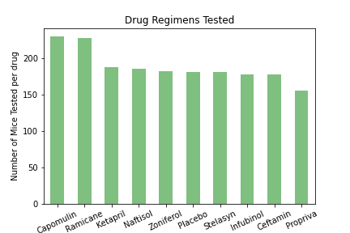
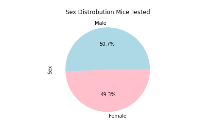
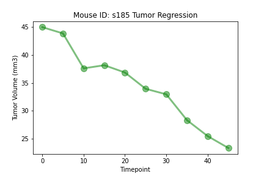
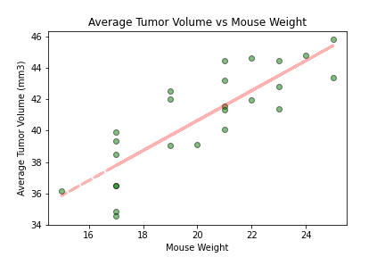
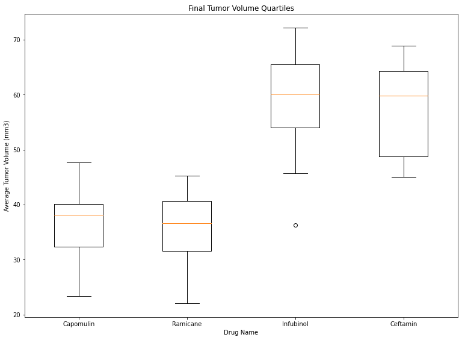
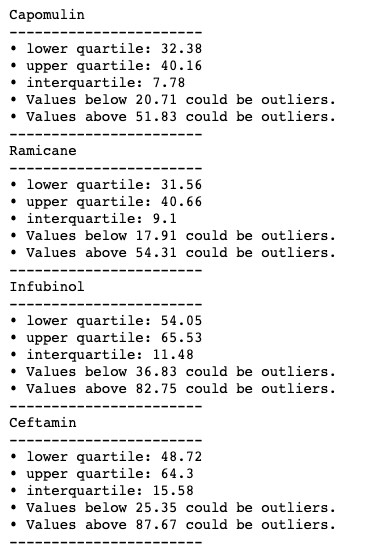

# Matplotlib Challenge
> The purpose of matplotlib challenge was to take our learnings of Dataframes, pandas, python, and now visual charts with Matplotlib

## Table of contents
* [General info](#general-info)
* [Data & Results](#data-&-results)
* [Setup](#setup)
* [Observations](#observations)
* [Status](#status)
* [Contact](#contact)

## General info
The purpose of this study was to compare the performance of Pymaceuticals' drug of interest, Capomulin, versus the other treatment regimens. You have been tasked by the executive team to generate all of the tables and figures needed for the technical report of the study. The executive team also has asked for a top-level summary of the study results.

## Data & Results

### Sample Drug Quartiles

## Setup
For this code to work we needed to install the following dependencies:

* pandas
* matplotlib.pyplot
* scipy.stats
* numpy
* sem
* sklearn
* linregress

## Code Examples
We used many types of functions such as:

#####For Loops:
`cols = []`  
`count = 1` 
`for column in new_df.columns:` 
&nbsp;&nbsp;&nbsp;&nbsp;&nbsp;&nbsp;&nbsp;&nbsp;&nbsp;&nbsp;&nbsp;&nbsp;`if column == "Tumor Volume (mm3)":` 
&nbsp;&nbsp;&nbsp;&nbsp;&nbsp;&nbsp;&nbsp;&nbsp;&nbsp;&nbsp;&nbsp;&nbsp;&nbsp;&nbsp;&nbsp;&nbsp;&nbsp;&nbsp;&nbsp;&nbsp;&nbsp;&nbsp;&nbsp;&nbsp;`cols.append(f"Tumor Volume (mm3)_{count}")` 
&nbsp;&nbsp;&nbsp;&nbsp;&nbsp;&nbsp;&nbsp;&nbsp;&nbsp;&nbsp;&nbsp;&nbsp;&nbsp;&nbsp;&nbsp;&nbsp;&nbsp;&nbsp;&nbsp;&nbsp;&nbsp;&nbsp;&nbsp;&nbsp;` count+=1` 
&nbsp;&nbsp;&nbsp;&nbsp;&nbsp;&nbsp;&nbsp;&nbsp;&nbsp;&nbsp;&nbsp;&nbsp;&nbsp;&nbsp;&nbsp;&nbsp;&nbsp;&nbsp;&nbsp;&nbsp;&nbsp;&nbsp;&nbsp;&nbsp;`continue` 
&nbsp;&nbsp;&nbsp;&nbsp;&nbsp;&nbsp;&nbsp;&nbsp;&nbsp;&nbsp;&nbsp;&nbsp;`cols.append(column)` 
`new_df.columns = cols` 

#####Groupbys:

`mouse_group = cleaned_df.groupby("Mouse ID")` 
`max_timepoint = mouse_group["Timepoint"].max()` 
`max_timepoint_df = max_timepoint.to_frame().reset_index()` 
`new_df = pd.merge(max_timepoint_df,`   &nbsp;&nbsp;&nbsp;&nbsp;&nbsp;&nbsp;&nbsp;&nbsp;&nbsp;&nbsp;&nbsp;&nbsp;`cleaned_df, on=["Mouse ID","Timepoint"])` &nbsp;&nbsp;&nbsp;&nbsp;&nbsp;&nbsp;&nbsp;&nbsp;&nbsp;&nbsp;&nbsp;&nbsp;`[["Drug Regimen", "Tumor Volume (mm3)"]]` 

#####and many others!:

## Observations
1. The Drug Regimen Ramicane produced the smallest average tumor sizes overall (40.22)
2. The Drug Regimen Ketapril produced the largest average tumor sizes overall (55.24)
3. The Drug Ketapril also had the highest variance of results (68.55)
4. Infubinol had one giant outlier in the quartile box plot data
5. For Capomulin, the longer the mouse was on the drug - the more the tumor was reduced
6. There is a corelation to the size in volume to the weight of the mouse - the bigger the mouse, the bigger the tumor.

## Status
This challenge was completed on October 10, 2020.

*Special thanks to Gretel!*

## Contact
Created by [Jennifer Dean](https://github.com/Jen-Dean) 